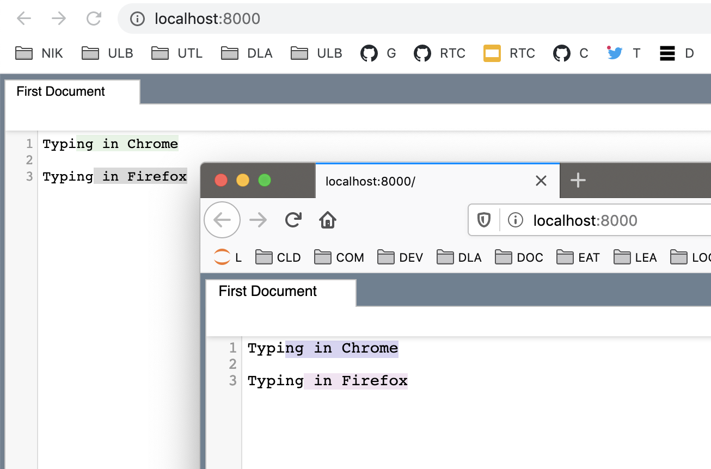
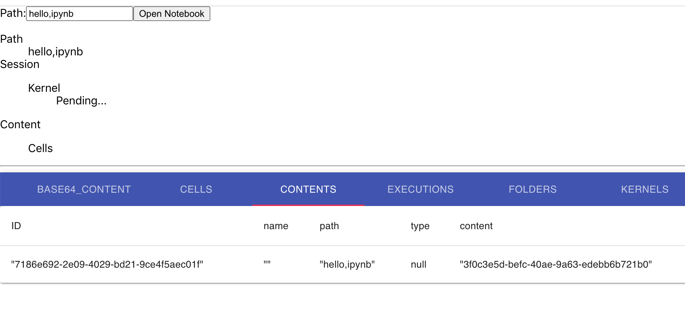

# Examples

The examples reside in the [examples folder](https://github.com/jupyterlab/rtc/tree/main/examples)

To build and try them all, you first need to install Yarn, Node.js and JupyterLab.

```bash
# Using conda, enter the following commands.
conda create -n rtc -c conda-forge jupyterlab nodejs=14 yarn
conda activate rtc
```

You can now clone the repository and build the sources.

```bash
git clone https://github.com/jupyterlab/rtc && \
  cd rtc && \
  yarn && \
  yarn build
```

## Lumino Example

This [simple Lumino datastore example](https://github.com/jupyterlab/rtc/tree/main/examples/lumino) is useful to demonstrate and understand the basics of the [Lumino Datastore](https://github.com/jupyterlab/lumino/tree/master/packages/datastore) system.

```bash
yarn lumino-example:start
```

Open in browser 1 (e.g. Chrome) <http://localhost:8000>. Then open that same link <http://localhost:8000> in browser 2 (e.g. Firefox).

Every character you input in one of the 2 browsers should be reflected in realtime in the other browser. The selections are also shared.



In the console, you will see logs showing the CRDT messageg flowing.

```
...
Broadcasting transactions to: 1
Sending reply: transaction-ack
Received message of type: transaction-broadcast
Broadcasting transactions to: 1
Sending reply: transaction-ack
Received message of type: transaction-broadcast
Broadcasting transactions to: 1
Sending reply: transaction-ack
Received message of type: transaction-broadcast
Broadcasting transactions to: 1
...
```

The content for this example has been taken from the [Lumino example-datastore folder](https://github.com/jupyterlab/lumino/tree/master/examples/example-datastore).

## To Do Example

You can start [To Do example application](https://github.com/jupyterlab/rtc/tree/main/examples/todo) and the [Debugger](https://github.com/jupyterlab/rtc/tree/main/tools/debugger).

```bash
yarn todo-example:start-all
```

The example application will be available on <http://localhost:3000>


## Jupyter Example

You can also start the [Jupyter example](https://github.com/jupyterlab/rtc/tree/main/examples/jupyter).

```bash
yarn jupyter-example:start-all
```

The normal JupyterLab application will be launched on <http://localhost:8888>. The RTC datastore will be available on <http://localhost:3000>.

Enter `hello.ipynb` as Path and click on `Open Notebook` button. You will be shown with the details of the hello notebook located in `packages/supernode` folder.


